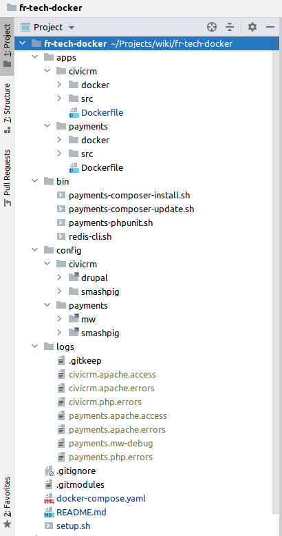

## WMF Fundraising Tech Docker stack
Proof of concept fr-tech stack using Docker.

## Install
1. run `git clone --recursive https://github.com/jackgleeson/fr-tech-docker` and `cd fr-tech-docker`
3. run `./setup.sh` and grab a coffee because it might take a while first time around. 

## What does it install?
1. Payments-wiki running on Apache/PHP 7.4. See here: https://localhost:8001
2. Civicrm running on Apache/PHP 7.3. See here: https://localhost:8002
3. MariaDB 
4. Redis 5.0

## Project Struture

## Docker commands
#### Daily commands
- run `docker-compose up` up the stack
- run `docker-compose down` down the stack
#### Throw it all away and start again
- run `docker-compose down -v` to stop and remove containers and clear out the database and queues volumes
- run `./setup.sh` to reinstall the stack afresh
### Rebuild the stack images (do this when you edit the Dockerfiles)
- run `docker-compose build` rebuild the underlying Docker images. 
##### Note: You can rebuild specific images by passing the name of the service as an argument e.g. `docker-compose build civicrm`
### Delete everything 
- run `docker-compose down -v -rmi all` to stop & remove containers and clear out the database and queues and delete the images
- run `rm -rf fr-tech-docker`

## Other
- checkout `/bin` for a bunch of useful shortcuts